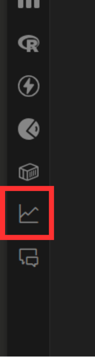
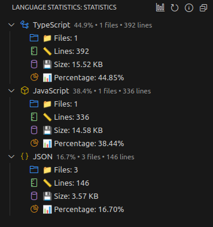

Attempt to create a VS Code Extension that mimics GitHub's language statistics for the current directory.

## Features
- Displays the language statistics of the current directory in a tree view.
- Shows the following statistics:
    - Number of files for each language
    - Total lines of code for each language
    - Total size of files for each language
    - Percentage of each language in the total codebase
- Support for 50 languages and frameworks.

## Demo

    
    

